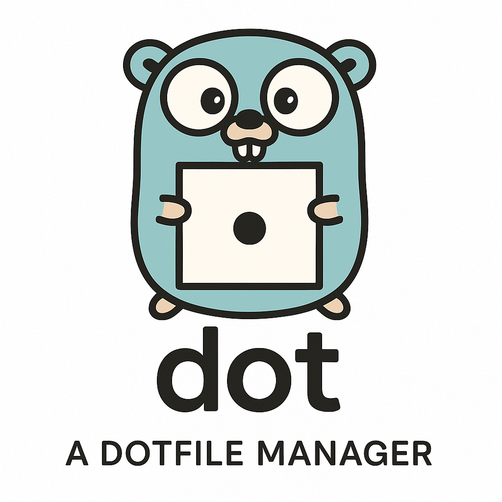

<div align="center">
  
</div>

# dot
[](https://github.com/yaklabco/dot/actions/workflows/ci.yml)
[](https://github.com/yaklabco/dot/actions/workflows/release-please.yml)
[](https://github.com/yaklabco/dot/releases)
[](https://goreportcard.com/report/github.com/yaklabco/dot)
[](LICENSE)

A type-safe symbolic link manager for configuration files and dotfiles, written in Go.

## Overview

dot manages configuration files through symbolic links, providing a centralized approach to dotfile management with strong safety guarantees. The tool creates and maintains symlinks from a directory (package repository) to a target directory (typically home directory), enabling version control and synchronization of configuration files across multiple machines.

### Key Capabilities

- **Repository Cloning**: Single-command setup on new machines with optional bootstrap configuration
- **Package Management**: Install, remove, and update packages containing configuration files
- **Conflict Resolution**: Detect and resolve conflicts with configurable resolution policies
- **Incremental Operations**: Content-based change detection for efficient updates
- **Transactional Safety**: Two-phase commit with automatic rollback on failure
- **State Tracking**: Manifest-based state management for fast status queries
- **Concurrency-Ready Executor**: Batched parallel execution implemented behind a plan-level gate, not yet enabled for CLI-generated plans
- **Cross-Platform**: Supports Linux, macOS, BSD, and Windows (with limitations)

## Installation

### Homebrew (macOS/Linux)

```bash
brew tap yaklabco/dot
brew install dot
```

### From Binary Releases

Download the archive for your platform from
[GitHub Releases](https://github.com/yaklabco/dot/releases).

Assets are named `dot_<version>_<Os>_<Arch>.tar.gz` (`.zip` on Windows), where
`<Os>` is `Linux`, `Darwin`, or `Windows` and `<Arch>` is `x86_64` or `arm64`.

```bash
# Set to the desired release, without the leading "v"
VERSION=0.6.5

OS=$(uname -s)
ARCH=$(uname -m)
[ "$ARCH" = "aarch64" ] && ARCH=arm64
[ "$ARCH" = "amd64" ] && ARCH=x86_64
curl -L "https://github.com/yaklabco/dot/releases/download/v${VERSION}/dot_${VERSION}_${OS}_${ARCH}.tar.gz" | tar xz
sudo mv dot /usr/local/bin/
```

### Nix

The repository is a flake with `x86_64-linux`, `aarch64-linux`, `x86_64-darwin`, and
`aarch64-darwin` outputs:

```bash
# Run without installing
nix run github:yaklabco/dot -- --help

# Build into ./result
nix build github:yaklabco/dot

# Install into a profile
nix profile install github:yaklabco/dot
```

To pull it into a system or home-manager configuration, add
`dot.url = "github:yaklabco/dot"` to your flake inputs and use
`dot.packages.${system}.default`.

### From Source

Requires Go 1.26.1 or later:

```bash
go install github.com/yaklabco/dot/cmd/dot@latest
```

### Verification

```bash
dot --version
```

## Quick Start

### New Machine Setup

Clone an existing dotfiles repository:

```bash
dot clone https://github.com/user/dotfiles
```

Like `git clone`, this creates a subdirectory named after the repository (e.g., `./dotfiles`). This single command:
- Clones the repository to the local directory
- Selects packages to install (via profile or interactively)
- Creates all symlinks
- Tracks repository information for updates
- Offers to save the package directory location to your config

The repository can include:
- **Configuration** (`.config/dot/config.yaml`): Repository-specific dot configuration that's automatically used after clone
- **Bootstrap** (`.dotbootstrap.yaml`): Package selection profiles, platform requirements, and installation policies

**Repository configuration** allows your repository to define how it should be managed without circular dependency. See [Repository Configuration](docs/user/repository-config.md) for details.

**Bootstrap configuration** enables installation profiles and platform-specific package selection. See [Bootstrap Specification](docs/user/bootstrap-config-spec.md) for details.

### Package Directory Resolution

`dot` intelligently locates your dotfiles repository using the following precedence:

1. **Explicit flag**: `--dir /path/to/dotfiles` (highest priority)
2. **Environment variable**: `DOT_PACKAGE_DIR=/path/to/dotfiles`
3. **Current directory**: If current directory contains `.dotbootstrap.yaml`
4. **Parent search**: Searches up directory tree for `.dotbootstrap.yaml`
5. **Configuration file**: From `directories.package` in config
6. **Default fallback**: `~/.dotfiles` (lowest priority)

This means you can `cd` into your dotfiles directory and run `dot` commands without flags, or set `DOT_PACKAGE_DIR` for project-wide consistency.

### Initial Setup

Create a package directory to store your packages:

```bash
mkdir -p ~/dotfiles/dot-vim
echo "set number" > ~/dotfiles/dot-vim/vimrc
```

### Manage a Package

Install the package by creating symlinks:

```bash
cd ~/dotfiles
dot manage dot-vim
```

This creates `~/.vim/vimrc` pointing to `~/dotfiles/dot-vim/vimrc`.

Under the default name-mapped layout, package names determine target directories:
- `dot-vim` → `~/.vim/`
- `dot-gnupg` → `~/.gnupg/`
- `vim` → `~/vim/`

Set `dotfile.package_name_mapping: false` for the full-tree layout instead, where the
package mirrors the target directory as in GNU Stow. See
[Repository Layouts](#repository-layouts).

### Check Status

View installed packages and their status:

```bash
dot status
```

### Unmanage a Package

Remove symlinks for a package:

```bash
dot unmanage dot-vim
```

## Core Concepts

### Package Directory

The source directory containing packages. Each subdirectory represents a package. Default: current directory.

### Target Directory

The destination directory where symlinks are created. Default: `$HOME`.

### Package

A directory within the package directory containing configuration files.

### Repository Layouts

dot supports two repository layouts, selected by `dotfile.package_name_mapping`.
Both are fully supported; choose the one that fits how your repository is organised.

**Name-mapped layout** (`package_name_mapping: true`, the default). The package name
is the target directory it owns:
- Package `dot-vim` → files installed to `~/.vim/`
- Package `dot-gnupg` → files installed to `~/.gnupg/`
- Package `config` → files installed to `~/config/`

This removes a level of nesting from the repository, at the cost of not being able
to place a file directly at `~/.vimrc`.

**Full-tree layout** (`package_name_mapping: false`). The package name identifies the
package only, and the tree inside it mirrors the target directory, the way GNU Stow
works:
- `vim/dot-vimrc` → `~/.vimrc`
- `gnupg/dot-gnupg/gpg.conf` → `~/.gnupg/gpg.conf`

Choose this when migrating an existing Stow repository, or when one package needs to
place files in several different directories under the target.

### Dotfile Translation

Files prefixed with `dot-` are translated to dotfiles (leading `.`):
- Within `dot-vim/`: `dot-vimrc` → `.vim/.vimrc`
- Within `config/`: `dot-bashrc` → `config/.bashrc`

Both package-level and file-level translation work together.

### Directory Folding

When all files in a directory belong to a single package, dot creates a single directory-level symlink instead of individual file symlinks, reducing symlink count and improving performance.

## Usage

<div align="center">
  
</div>

### Package Management Commands

#### Manage (Install)

Create symlinks for packages:

```bash
# Single package
dot manage dot-vim

# Multiple packages
dot manage dot-vim dot-tmux dot-zsh

# With options
dot --dir ~/dotfiles --target $HOME manage dot-vim
dot --dry-run manage dot-vim        # Preview changes
```

#### Unmanage (Remove)

Remove symlinks for packages:

```bash
# Single package
dot unmanage dot-vim

# Multiple packages
dot unmanage dot-vim dot-tmux

# Preview removal
dot --dry-run unmanage dot-vim
```

#### Remanage (Update)

Update packages (remove and reinstall with incremental detection):

```bash
# Update packages efficiently
dot remanage dot-vim

# Updates only changed packages
dot remanage dot-vim dot-tmux dot-zsh
```

#### Adopt (Import)

Move existing files into a package and replace with symlinks.

**Interactive Mode**

Run without arguments to interactively discover and select dotfiles. This mode scans your home directory for potential dotfiles and presents a TUI for selection.

```bash
dot adopt
```

<div align="center">
  
</div>

**Command Line Mode**

Use for scripting or known files:

```bash
# Auto-naming: single file (package name derived from filename)
dot adopt ~/.vimrc
# Creates package: dot-vimrc

# Auto-naming: single directory (package name derived from directory)
dot adopt ~/.ssh
# Creates package: dot-ssh

# Explicit package: specify package name for multiple files
dot adopt vim ~/.vimrc ~/.vim
dot adopt zsh ~/.zshrc ~/.zprofile ~/.zshenv

# Shell glob expansion: specify package name
dot adopt git .git*
# Package "git" with all .git* files
```

**Note**: When adopting multiple files via command line, you must provide an explicit package name as the first argument.

**Interactive Options**

```bash
dot adopt --scan-dirs ~/.config    # Scan additional directories
dot adopt --max-size 100MB         # Increase file size limit
```

### Repository Commands

#### Clone

Clone a dotfiles repository and set up on a new machine:

```bash
# Basic clone (creates ./dotfiles directory)
dot clone https://github.com/user/dotfiles

# Clone creates ./my-dotfiles directory based on repo name
dot clone https://github.com/user/my-dotfiles

# Clone with specific profile
dot clone https://github.com/user/dotfiles --profile minimal

# Clone specific branch
dot clone https://github.com/user/dotfiles --branch develop

# Clone to specific directory (overrides default)
dot clone --dir ~/packages https://github.com/user/dotfiles
```

The clone command:
- Clones the Git repository into a subdirectory (named after the repo, like `git clone`)
- Reads `.dotbootstrap.yaml` if present for configuration
- Prompts for package selection (or uses specified profile)
- Creates all symlinks for selected packages
- Tracks repository information in manifest for future updates

#### Clone Bootstrap

Generate a `.dotbootstrap.yaml` configuration file from your current installation:

```bash
# Generate in package directory
dot clone bootstrap

# Specify output location
dot clone bootstrap --output ~/dotfiles/.dotbootstrap.yaml

# Preview without writing
dot clone bootstrap --dry-run

# Only include currently installed packages
dot clone bootstrap --from-manifest

# Set default conflict policy
dot clone bootstrap --conflict-policy backup

# Overwrite existing file
dot clone bootstrap --force
```

The generated configuration includes:
- All discovered packages (or only installed ones with `--from-manifest`)
- Default conflict resolution policy
- Commented template for defining profiles
- Helpful documentation links

After generation, customize the file to:
- Mark packages as required
- Define installation profiles (minimal, full, development)
- Add platform-specific package restrictions
- Set per-package conflict policies

See [Bootstrap Configuration Specification](docs/user/bootstrap-config-spec.md) for details.

### Query Commands

#### Status

Display installation status:

```bash
# All packages
dot status

# Specific packages
dot status dot-vim dot-tmux

# Different formats
dot status --format json
dot status --format yaml
dot status --format table
```

#### Doctor

Validate installation consistency and detect issues:

```bash
# Health check
dot doctor

# With detailed diagnostic output
dot doctor --detailed

# Deep scan mode
dot doctor --mode deep

# JSON output for scripting
dot doctor --format json

# Manage the orphan ignore list without interactive triage
dot doctor ignore .nix-profile --reason "nix managed"
dot doctor ignore --pattern "Code/*"
dot doctor unignore --pattern "Code/*"
dot doctor ignores
```

Exit codes:
- 0: No issues detected
- 1: Warnings found
- 2: Errors found
- 130: Interrupted (SIGINT)

#### List

Show installed packages:

```bash
# List all packages
dot list

# Sort by various fields
dot list --sort name      # Alphabetical (default)
dot list --sort links     # By link count
dot list --sort date      # By installation date

# Different formats
dot list --format table
dot list --format json
```

### Global Options

```bash
-d, --dir PATH        Source directory containing packages (default: ".")
-t, --target PATH     Target directory for symlinks (default: $HOME)
    --backup-dir PATH Directory for backup files (default: <target>/.dot-backup)
-n, --dry-run         Show what would be done without applying changes
-v, --verbose         Increase verbosity: -v (info), -vv (debug), -vvv (trace)
-q, --quiet           Suppress all non-error output
    --log-json        Output logs in JSON format
    --no-color        Disable color output
    --batch           Batch mode for scripting (implies --quiet, non-interactive)
    --ignore PATTERN  Additional ignore patterns (repeatable, supports !negation)
    --max-file-size S Maximum file size to include (e.g. 100MB); empty = no limit
    --no-defaults     Disable default ignore patterns (.git, .DS_Store, etc.)
    --no-dotignore    Disable reading per-package .dotignore files
    --cpu-profile F   Write CPU profile to file
    --mem-profile F   Write memory profile to file
    --pprof ADDR      Enable pprof HTTP server on address (e.g. :6060)
```

Symlink mode and directory folding are configuration keys, not flags: set
`symlinks.mode` to `absolute` and `symlinks.folding` to `false`.

### Maintenance Commands

#### Tool Upgrade

Update dot to the latest version:

```bash
# Check for and install updates
dot upgrade

# Check without installing
dot upgrade --check-only
```

## Configuration

dot supports configuration files in YAML, JSON, or TOML formats.

### Configuration Management

Manage configuration settings directly from the CLI:

```bash
# Initialize a new configuration file
dot config init

# View current configuration
dot config list

# Get a specific value
dot config get directories.package

# Set a value (log levels are upper case)
dot config set logging.level DEBUG

# Show configuration file path
dot config path

# Upgrade configuration format
dot config upgrade
```

### Configuration Locations

Resolved in order (first match wins for the file; env and flags then overlay):

1. Repository-local: `<package-dir>/.config/dot/config.yaml` (highest file priority)
2. `$DOT_CONFIG`, if set, naming an explicit config file
3. User global: `$XDG_CONFIG_HOME/dot/config.yaml`, else `~/.config/dot/config.yaml`
4. Environment variables: `DOT_` prefix with `.` replaced by `_`
   (for example `DOT_DIRECTORIES_PACKAGE`, `DOT_LOGGING_LEVEL`)
5. Command-line flags (highest priority)

Environment and flag overlays cover a subset of keys only; see
`internal/config/loader.go` for the bound key list.

### Configuration Example

Path values are expanded when the configuration is loaded: a leading `~` resolves to
the home directory and `$VAR` or `${VAR}` resolves from the environment. This applies
to `directories.package`, `directories.target`, `directories.manifest`,
`symlinks.backup_dir`, and `logging.file`. Quote a bare tilde, because an unquoted
`target: ~` is YAML null rather than a path.

```yaml
# ~/.config/dot/config.yaml
directories:
  package: ~/dotfiles
  target: "~"

logging:
  level: INFO
  format: text
  destination: stderr

symlinks:
  mode: relative
  folding: true
  overwrite: false
  backup: false
  backup_suffix: .bak
  backup_dir: ""

ignore:
  use_defaults: true
  patterns:
    - "*.log"
    - "*.swp"
  per_package_ignore: true
  max_file_size: 0

dotfile:
  translate: true
  prefix: dot-
  package_name_mapping: true

output:
  format: text
  color: auto
  progress: true
  verbosity: 1

operations:
  atomic: true
  dry_run: false
```

### Configuration Options

Frequently used keys. See [Configuration Reference](docs/user/04-configuration.md)
for the complete 12-section schema.

| Key | Type | Default | Description |
|-----|------|---------|-------------|
| `directories.package` | string | `.` | Source directory containing packages |
| `directories.target` | string | `$HOME` | Destination for symlinks |
| `directories.manifest` | string | `$XDG_DATA_HOME/dot/manifest` | Installation state directory |
| `logging.level` | string | `INFO` | One of `DEBUG`, `INFO`, `WARN`, `ERROR` (case sensitive) |
| `logging.format` | string | `text` | `text` or `json` |
| `symlinks.mode` | string | `relative` | `relative` or `absolute` |
| `symlinks.folding` | boolean | `true` | Enable directory folding optimization |
| `symlinks.overwrite` | boolean | `false` | Replace conflicting files |
| `symlinks.backup` | boolean | `false` | Back up conflicting files before replacing |
| `symlinks.backup_dir` | string | `<target>/.dot-backup` | Conflict backup destination |
| `ignore.use_defaults` | boolean | `true` | Apply the built-in ignore pattern set |
| `ignore.patterns` | array | `[]` | Additional patterns to exclude |
| `dotfile.translate` | boolean | `true` | Translate `dot-` file prefixes to `.` |
| `dotfile.package_name_mapping` | boolean | `true` | `true` for the name-mapped layout, `false` for the full-tree (Stow-style) layout |
| `output.format` | string | `text` | `text`, `json`, `yaml`, or `table` |
| `operations.atomic` | boolean | `true` | Roll back the whole plan on any failure |

`dot config get` resolves a subset of keys, and `dot config set` accepts a larger
but different subset. Neither covers `update.*` or `network.*`.

## Conflict Resolution

dot detects conflicts when existing files or symlinks prevent package installation.

### Resolution Policies

The policy applied to an existing regular file at a link target is selected by two
configuration keys:

| `symlinks.overwrite` | `symlinks.backup` | Effective policy |
|---|---|---|
| `false` | `false` | fail (default): stop and report the conflict |
| `false` | `true` | backup: copy the file into the backup directory, then replace it |
| `true` | any | overwrite: replace the file with the symlink |

All other conflict classes (wrong link destination, permission error, type mismatch)
always fail and are not configurable.

Set the policy persistently or per invocation:

```bash
# Persist in the configuration file
dot config set symlinks.backup true

# Per invocation via environment variable
DOT_SYMLINKS_BACKUP=true dot manage vim
DOT_SYMLINKS_OVERWRITE=true dot manage vim
```

### Backup Behavior

Backup destination defaults to `<target>/.dot-backup` and is overridden with the
global `--backup-dir` flag or the `symlinks.backup_dir` configuration key. Backup
files are named `<basename>.<path-hash>.<YYYYMMDD-HHMMSS>`, where `<path-hash>` is
the first four bytes of the SHA-256 of the source path, so files sharing a basename
in different directories do not collide. The backup directory is created on demand
when the first backup is written.

Known limitations:

- `symlinks.backup_suffix` is accepted and validated but not applied to conflict
  backup filenames.
- `symlinks.backup_dir` can be read with `dot config get` but not written with
  `dot config set`; edit the configuration file or use `--backup-dir`.

See [User Guide - Workflows](docs/user/06-workflows.md) for conflict resolution strategies.

## System Requirements

### Operating Systems

- Linux (all distributions)
- macOS 10.15 or later
- FreeBSD, OpenBSD, NetBSD
- Windows 10 or later (with symlink support enabled)

### Filesystems

Full support:
- ext4, btrfs, xfs (Linux)
- APFS, HFS+ (macOS)
- ZFS (all platforms)

Limited support:
- FAT32, exFAT (no symlink support)
- Network filesystems (NFS, SMB) with caveats

### Architectures

Prebuilt binaries are published for:

- amd64 (x86-64): Linux, macOS, Windows
- arm64 (aarch64): Linux, macOS

Other architectures supported by the Go toolchain can be built from source with
`go install github.com/yaklabco/dot/cmd/dot@latest`.

## Documentation

Complete documentation index available at [docs/README.md](docs/README.md).

### User Documentation

- [User Guide Index](docs/user/index.md) - Complete navigation
- [Introduction and Core Concepts](docs/user/01-introduction.md)
- [Installation Guide](docs/user/02-installation.md)
- [Quick Start Tutorial](docs/user/03-quickstart.md)
- [Configuration Reference](docs/user/04-configuration.md)
- [Command Reference](docs/user/05-commands.md)
- [Common Workflows](docs/user/06-workflows.md)
- [Advanced Features](docs/user/07-advanced.md)
- [Troubleshooting Guide](docs/user/08-troubleshooting.md)
- [Glossary](docs/user/09-glossary.md)
- [Migration from GNU Stow](docs/user/migration-from-stow.md)

### Developer Documentation

- [Documentation Index](docs/README.md)
- [Architecture Documentation](docs/developer/architecture.md)
- [Contributing Guide](CONTRIBUTING.md)
- [Release Workflow](docs/developer/release-workflow.md)

### Examples

- [Basic Usage Examples](examples/basic/)
- [Examples README](examples/README.md)

## Development

### Building

```bash
make build
```

### Testing

```bash
# Run all tests with race detection and coverage profile
make test

# Same, with formatted tparse output
make test-tparse

# Verify the coverage profile meets the 60% gate
make check-coverage

# Generate and open an HTML coverage report
make coverage
```

### Linting

```bash
make lint    # golangci-lint
make vet     # go vet
make fmt     # Check formatting
```

### Quality Checks

```bash
# Run the complete quality suite
make check
```

This runs tests, the coverage gate, linters, vet, and the vulnerability check.
It does not build the binary; run `make build` separately.

## Architecture

dot follows a layered architecture with functional programming principles:

### Layers

1. **Domain Layer**: Pure domain model with phantom-typed paths for compile-time safety
2. **Core Layer**: Pure functional logic for scanning, planning, and resolution
3. **Pipeline Layer**: Composable pipeline stages with generic type parameters
4. **Executor Layer**: Side-effecting operations with two-phase commit and rollback
5. **API Layer**: Clean public Go library interface for embedding
6. **CLI Layer**: Cobra-based command-line interface

### Design Principles

- **Functional Core, Imperative Shell**: Pure planning with isolated side effects
- **Type Safety**: Phantom types prevent path-related bugs at compile time
- **Explicit Errors**: Result types and error aggregation, never silent failures
- **Transactional**: Two-phase commit with automatic rollback on errors
- **Observable**: Structured logging, distributed tracing, metrics collection
- **Testable**: Pure core enables property-based testing of algebraic laws

See [User Guide - Advanced Features](docs/user/07-advanced.md) for implementation details.

## Library Usage

dot can be embedded as a Go library:

```go
package main

import (
    "context"
    "github.com/yaklabco/dot/pkg/dot"
)

func main() {
    cfg := dot.Config{
        PackageDir: "/home/user/dotfiles",
        TargetDir:  "/home/user",
        LinkMode:   dot.LinkRelative,
        Folding:    true,
    }
    
    client, err := dot.New(cfg)
    if err != nil {
        panic(err)
    }
    
    ctx := context.Background()
    if err := client.Manage(ctx, "vim", "tmux"); err != nil {
        panic(err)
    }
}
```

## Contributing

Contributions are welcome. All contributions must follow project standards:

### Requirements

- Test-driven development: write tests before implementation
- Coverage gates: 60% locally, 75% in CI
- All linters must pass without warnings
- Conventional Commits specification for commit messages
- Atomic commits: one logical change per commit
- Academic documentation style: factual, precise, no hyperbole

### Process

1. Fork the repository
2. Create a feature branch
3. Write tests for new functionality
4. Implement the feature
5. Ensure all tests and linters pass
6. Submit a pull request

See [Contributing Guide](CONTRIBUTING.md) for detailed guidelines.

## License

MIT License - see [LICENSE](LICENSE) file for details.

## Project Standards

This project adheres to strict development standards:

- **Language**: Go 1.26.1
- **Development**: Test-Driven Development (TDD) mandatory
- **Testing**: 60% local and 75% CI coverage gates, property-based tests for core logic
- **Commits**: Atomic commits with Conventional Commits format
- **Code Style**: golangci-lint v2 with comprehensive linter set
- **Documentation**: Academic style, factual, technically precise
- **Versioning**: Semantic Versioning 2.0.0
- **Changelog**: Keep a Changelog format

## Comparison with GNU Stow

dot is inspired by [GNU Stow](https://www.gnu.org/software/stow/). dot provides feature parity with GNU Stow plus additional capabilities:

| Feature | dot | GNU Stow |
|---------|-----|----------|
| Basic stow/unstow | Yes | Yes |
| Conflict detection | Yes | Yes |
| Directory folding | Yes | Yes |
| Incremental updates | Yes | No |
| Transactional operations | Yes | No |
| Parallel execution | Planned | No |
| Adopt existing files | Yes | No |
| Status/health checks | Yes | No |
| Multiple output formats | Yes | No |
| Type safety | Yes | No |
| Cross-platform | Yes | Limited |

See [Migration Guide](docs/user/migration-from-stow.md) for transitioning from GNU Stow.

## Support

- **Documentation**: [docs/](docs/)
- **Issues**: [GitHub Issues](https://github.com/yaklabco/dot/issues)
- **Discussions**: [GitHub Discussions](https://github.com/yaklabco/dot/discussions)

## Project Status

**Stability**: Stable

See [CHANGELOG](CHANGELOG.md) for release history.

## Acknowledgments

Inspired by GNU Stow, reimplemented with modern language features and safety guarantees.
