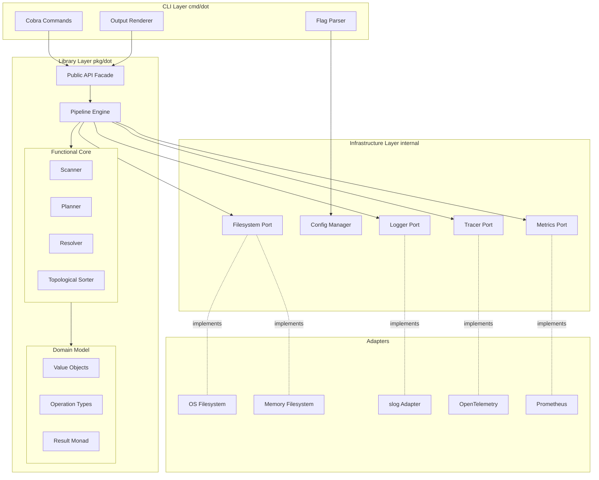
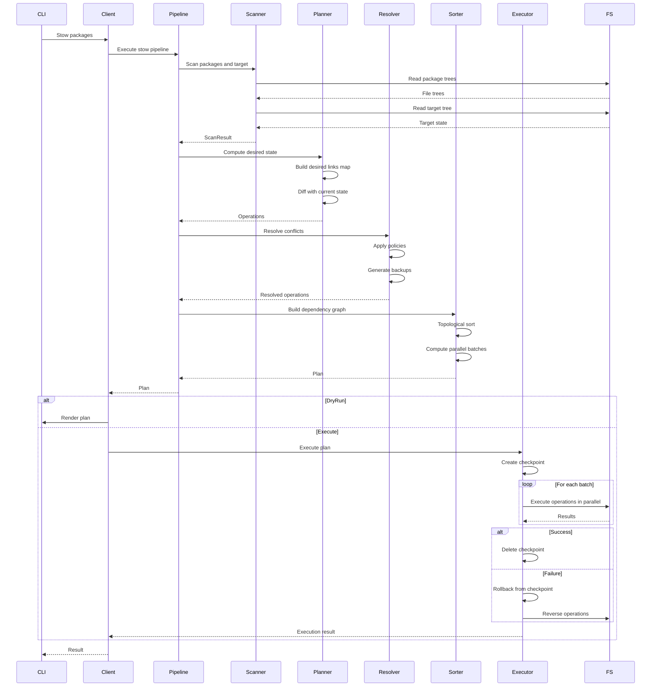
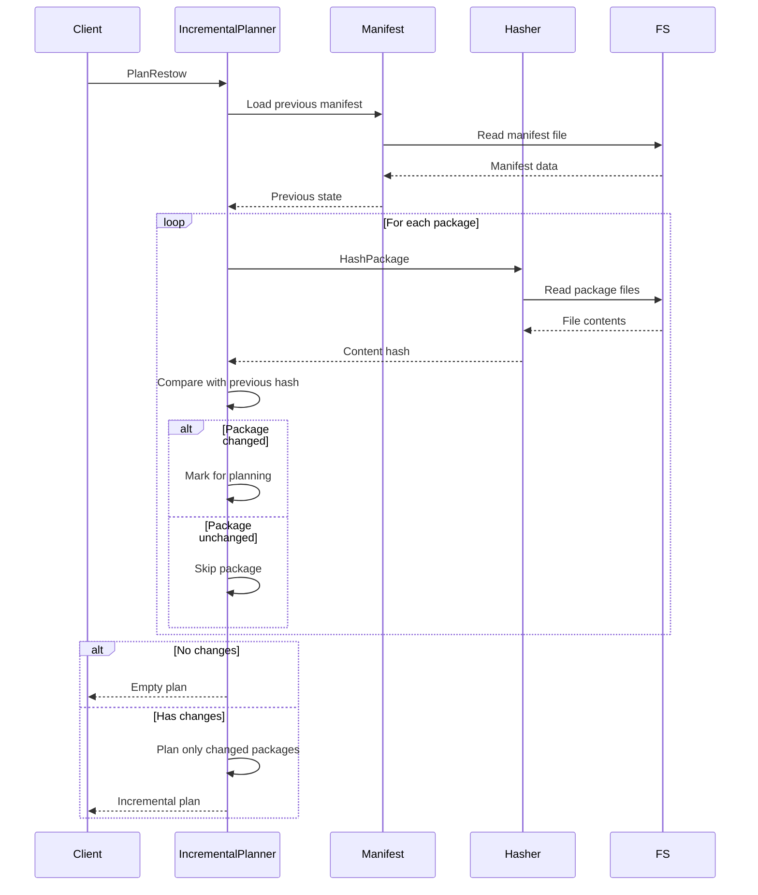

## dot (Go Symlink Manager) — Refined Technical Architecture

### Design Principles

- **Functional Core, Imperative Shell**: Pure planning with isolated side effects
- **Type-Driven Development**: Leverage Go generics and phantom types for compile-time safety
- **Property-Based Correctness**: Define and verify mathematical invariants
- **Explicit Error Handling**: Collect all errors, never fail fast silently
- **Streaming by Default**: Handle arbitrarily large package trees efficiently
- **Observable Operations**: First-class tracing, metrics, and diagnostics
- **Library First**: Core has zero CLI dependencies, fully embeddable

---

## Objectives

- Feature-complete GNU Stow replacement with modern safety guarantees
- Type-safe path handling preventing entire classes of bugs
- Comprehensive error recovery with two-phase commit and rollback
- Incremental planning for fast restow operations
- Streaming APIs for memory-efficient large-scale operations
- Production-ready observability (OpenTelemetry, Prometheus, structured logs)
- Property-based test suite verifying algebraic laws
- Zero-dependency core library with CLI as thin wrapper

---

## High-Level Architecture



---

## Package Structure

```
dot/
├── cmd/dot/                    # CLI entry point
│   ├── main.go
│   ├── root.go                 # Root command
│   └── commands/               # Subcommands
│       ├── stow.go
│       ├── unstow.go
│       ├── restow.go
│       ├── adopt.go
│       ├── status.go
│       ├── doctor.go
│       └── list.go
│
├── pkg/dot/                    # Public library API
│   ├── client.go               # Client facade (delegates to services)
│   ├── manifest_service.go     # Manifest management service
│   ├── manage_service.go       # Package installation service
│   ├── unmanage_service.go     # Package removal service
│   ├── status_service.go       # Status/listing service
│   ├── doctor_service.go       # Health check service
│   ├── adopt_service.go        # File adoption service
│   └── types.go                # Re-exported domain types
│
├── internal/
│   ├── domain/                 # Domain model (pure)
│   │   ├── path.go             # Phantom-typed paths
│   │   ├── operation.go        # Operation type hierarchy
│   │   ├── plan.go             # Plan with validation
│   │   ├── package.go          # Package representation
│   │   ├── tree.go             # Tree structures
│   │   ├── result.go           # Result monad
│   │   └── invariants.go       # Domain invariants
│   │
│   ├── core/                   # Functional core (pure)
│   │   ├── scanner/
│   │   │   ├── scanner.go      # Tree scanning
│   │   │   ├── parallel.go     # Concurrent scanning
│   │   │   └── dotfile.go      # Dotfile translation
│   │   ├── planner/
│   │   │   ├── planner.go      # Desired state computation
│   │   │   ├── diff.go         # State diffing
│   │   │   ├── incremental.go  # Incremental planning
│   │   │   └── fold.go         # Directory folding logic
│   │   ├── resolver/
│   │   │   ├── resolver.go     # Conflict resolution
│   │   │   ├── policies.go     # Resolution policies
│   │   │   └── graph.go        # Dependency graph
│   │   └── sort/
│   │       ├── topo.go         # Topological sort
│   │       └── parallel.go     # Parallelization analysis
│   │
│   ├── pipeline/               # Pipeline orchestration
│   │   ├── engine.go           # Pipeline execution
│   │   ├── stages.go           # Pipeline stages
│   │   ├── context.go          # Pipeline context
│   │   └── streaming.go        # Stream operators
│   │
│   ├── executor/               # Imperative shell
│   │   ├── executor.go         # Plan execution
│   │   ├── transaction.go      # Two-phase commit
│   │   ├── rollback.go         # Rollback logic
│   │   └── checkpoint.go       # State checkpointing
│   │
│   ├── ignore/                 # Ignore pattern system
│   │   ├── engine.go           # Pattern matching
│   │   ├── parser.go           # Pattern compilation
│   │   ├── defaults.go         # Default patterns
│   │   └── cache.go            # Compiled pattern cache
│   │
│   ├── manifest/               # State tracking
│   │   ├── manifest.go         # Installed state
│   │   ├── store.go            # Persistence
│   │   └── hash.go             # Content hashing
│   │
│   ├── ports/                  # Infrastructure interfaces
│   │   ├── fs.go               # Filesystem port
│   │   ├── logger.go           # Logger port
│   │   ├── tracer.go           # Tracer port
│   │   └── metrics.go          # Metrics port
│   │
│   ├── adapters/               # Port implementations
│   │   ├── osfs/               # OS filesystem
│   │   ├── memfs/              # In-memory (afero)
│   │   ├── slogger/            # slog adapter
│   │   ├── otel/               # OpenTelemetry
│   │   └── prometheus/         # Prometheus metrics
│   │
│   ├── config/                 # Configuration
│   │   ├── config.go           # Config types
│   │   ├── loader.go           # Viper integration
│   │   ├── validator.go        # Config validation
│   │   └── merge.go            # Merge strategies
│   │
│   └── cli/                    # CLI infrastructure
│       ├── binder.go           # Flag to domain binding
│       ├── renderer/           # Output rendering
│       │   ├── text.go
│       │   ├── json.go
│       │   └── table.go
│       └── errors.go           # User-facing errors
│
└── test/
    ├── fixtures/               # Test data
    │   ├── scenarios/          # Organized by scenario
    │   └── golden/             # Golden outputs
    ├── properties/             # Property tests
    │   ├── laws.go             # Algebraic laws
    │   └── generators.go       # Data generators
    └── integration/            # Integration tests
        └── e2e_test.go
```

---

## Core Domain Types

### Phantom-Typed Paths

```go
// Path type with phantom type parameter for compile-time safety
type Path[T PathKind] struct {
  value string
}

// Path kind markers
type PathKind interface{ pathKind() }
type PackageDirKind struct{}
type TargetDirKind struct{}
type PackageDirKind struct{}
type FileDirKind struct{}

func (PackageDirKind) pathKind()    {}
func (TargetDirKind) pathKind()  {}
func (PackageDirKind) pathKind() {}
func (FileDirKind) pathKind()    {}

// Type aliases for clarity
type StowPath = Path[PackageDirKind]
type TargetPath = Path[TargetDirKind]
type PackagePath = Path[PackageDirKind]
type FilePath = Path[FileDirKind]

// Smart constructors with validation
func NewStowPath(s string) Result[StowPath] {
  if !filepath.IsAbs(s) {
    return Err[StowPath](ErrRelativePath{s})
  }
  return Ok(Path[PackageDirKind]{clean(s)})
}

// Type-safe path operations
func (p StowPath) Join(pkg string) PackagePath {
  return Path[PackageDirKind]{filepath.Join(p.value, pkg)}
}

// Cannot mix incompatible path types
// p.Join(targetPath) // Compile error!
```

### Operation Type Hierarchy

```go
// Operation interface for type-safe operations
type Operation interface {
  Kind() OperationKind
  Validate() error
  Dependencies() []OperationID
  Execute(ctx context.Context, fs FS) error
  Rollback(ctx context.Context, fs FS) error
}

type OperationID string

// Concrete operation types
type LinkCreate struct {
  ID     OperationID
  Source FilePath
  Target TargetPath
  Mode   LinkMode
}

type LinkDelete struct {
  ID     OperationID
  Target TargetPath
}

type DirCreate struct {
  ID   OperationID
  Path TargetPath
}

type DirDelete struct {
  ID   OperationID
  Path TargetPath
}

type FileMove struct {
  ID     OperationID
  From   TargetPath
  To     PackagePath
  Backup bool
}

type FileBackup struct {
  ID   OperationID
  Path TargetPath
  Dest FilePath
}

// Each implements Operation interface with specific logic
func (op LinkCreate) Execute(ctx context.Context, fs FS) error {
  return fs.Symlink(ctx, op.Source.String(), op.Target.String())
}

func (op LinkCreate) Rollback(ctx context.Context, fs FS) error {
  return fs.Remove(ctx, op.Target.String())
}

func (op LinkCreate) Dependencies() []OperationID {
  // LinkCreate depends on parent DirCreate
  return []OperationID{dirCreateIDFor(op.Target.Parent())}
}
```

### Result Type for Error Handling

```go
// Result monad for composable error handling
type Result[T any] struct {
  value T
  err   error
}

func Ok[T any](v T) Result[T] {
  return Result[T]{value: v}
}

func Err[T any](e error) Result[T] {
  return Result[T]{err: e}
}

func (r Result[T]) IsOk() bool {
  return r.err == nil
}

func (r Result[T]) Unwrap() (T, error) {
  return r.value, r.err
}

// Functor: Map transforms the success value
func Map[A, B any](r Result[A], f func(A) B) Result[B] {
  if !r.IsOk() {
    return Err[B](r.err)
  }
  return Ok(f(r.value))
}

// Monad: FlatMap chains Results
func FlatMap[A, B any](r Result[A], f func(A) Result[B]) Result[B] {
  if !r.IsOk() {
    return Err[B](r.err)
  }
  return f(r.value)
}

// Collect multiple Results, accumulating errors
func Collect[T any](results []Result[T]) Result[[]T] {
  var values []T
  var errs []error
  
  for _, r := range results {
    if r.IsOk() {
      values = append(values, r.value)
    } else {
      errs = append(errs, r.err)
    }
  }
  
  if len(errs) > 0 {
    return Err[[]T](ErrMultiple{errs})
  }
  return Ok(values)
}
```

### Plan with Validation

```go
// Plan represents a validated, executable plan
type Plan struct {
  operations []Operation
  graph      *DependencyGraph
  metadata   PlanMetadata
  checksum   string
}

type PlanMetadata struct {
  CreatedAt   time.Time
  PackageSet  []string
  OpCounts    map[OperationKind]int
  Conflicts   []Conflict
  Warnings    []Warning
}

// Smart constructor ensures plan validity
func NewPlan(ops []Operation) Result[Plan] {
  // Build dependency graph
  graph := BuildGraph(ops)
  
  // Detect cycles
  if cycle := graph.FindCycle(); cycle != nil {
    return Err[Plan](ErrCyclicDependency{cycle})
  }
  
  // Validate all operations
  for _, op := range ops {
    if err := op.Validate(); err != nil {
      return Err[Plan](err)
    }
  }
  
  // Topologically sort
  sorted, err := graph.TopologicalSort()
  if err != nil {
    return Err[Plan](err)
  }
  
  metadata := computeMetadata(ops)
  checksum := computeChecksum(sorted)
  
  return Ok(Plan{
    operations: sorted,
    graph:      graph,
    metadata:   metadata,
    checksum:   checksum,
  })
}

// Immutable access
func (p Plan) Operations() []Operation {
  return slices.Clone(p.operations)
}

func (p Plan) ParallelBatches() [][]Operation {
  return p.graph.ParallelizationPlan()
}
```

### Package and Tree Types

```go
type Package struct {
  Name     string
  Path     PackagePath
  Files    FileTree
  Metadata PackageMetadata
}

type PackageMetadata struct {
  IgnorePatterns []Pattern
  LinkMode       LinkMode
  Folding        bool
}

// Tree representation
type FileTree struct {
  Root *Node
}

type Node struct {
  Name     string
  Path     FilePath
  Type     NodeType
  Children []*Node
  Info     os.FileInfo
}

type NodeType int

const (
  NodeFile NodeType = iota
  NodeDir
  NodeSymlink
)

// Functional tree operations
func (t FileTree) Map(f func(*Node) *Node) FileTree {
  return FileTree{Root: mapNode(t.Root, f)}
}

func (t FileTree) Filter(pred func(*Node) bool) FileTree {
  return FileTree{Root: filterNode(t.Root, pred)}
}

func (t FileTree) Fold(init any, f func(any, *Node) any) any {
  return foldNode(init, t.Root, f)
}
```

---

## Functional Core Pipeline

### Pipeline Architecture

```go
// Pipeline stages compose via generic Pipeline type
type Pipeline[A, B any] func(context.Context, A) Result[B]

// Compose pipelines
func Compose[A, B, C any](p1 Pipeline[A, B], p2 Pipeline[B, C]) Pipeline[A, C] {
  return func(ctx context.Context, a A) Result[C] {
    r1 := p1(ctx, a)
    if !r1.IsOk() {
      return Err[C](r1.err)
    }
    return p2(ctx, r1.value)
  }
}

// Parallel execution of independent pipelines
func Parallel[A, B any](pipelines []Pipeline[A, B]) Pipeline[A, []B] {
  return func(ctx context.Context, a A) Result[[]B] {
    results := make([]Result[B], len(pipelines))
    
    var wg sync.WaitGroup
    for i, p := range pipelines {
      wg.Add(1)
      go func(idx int, pipeline Pipeline[A, B]) {
        defer wg.Done()
        results[idx] = pipeline(ctx, a)
      }(i, p)
    }
    wg.Wait()
    
    return Collect(results)
  }
}

// Core pipeline stages
type StowPipeline struct {
  scan     Pipeline[ScanInput, ScanResult]
  plan     Pipeline[ScanResult, PlanResult]
  resolve  Pipeline[PlanResult, ResolveResult]
  order    Pipeline[ResolveResult, Plan]
}

func NewStowPipeline(opts PipelineOpts) StowPipeline {
  return StowPipeline{
    scan:    NewScanner(opts.FS, opts.Ignore),
    plan:    NewPlanner(opts.LinkMode, opts.Folding),
    resolve: NewResolver(opts.Policies),
    order:   NewSorter(),
  }
}

func (p StowPipeline) Execute(ctx context.Context, input ScanInput) Result[Plan] {
  pipeline := Compose(
    Compose(
      Compose(p.scan, p.plan),
      p.resolve,
    ),
    p.order,
  )
  return pipeline(ctx, input)
}
```

### Scanner (Pure)

```go
type ScanInput struct {
  PackageDir   StowPath
  TargetDir TargetPath
  Packages  []string
  Ignore    IgnoreSet
}

type ScanResult struct {
  Packages []Package
  Target   FileTree
  Errors   []ScanError
}

// Pure scanner function
func Scan(ctx context.Context, fs FS, input ScanInput) Result[ScanResult] {
  // Parallel package scanning
  packageResults := make([]Result[Package], len(input.Packages))
  
  var wg sync.WaitGroup
  for i, pkgName := range input.Packages {
    wg.Add(1)
    go func(idx int, name string) {
      defer wg.Done()
      packageResults[idx] = scanPackage(ctx, fs, input.PackageDir, name, input.Ignore)
    }(i, pkgName)
  }
  wg.Wait()
  
  packages := Collect(packageResults)
  if !packages.IsOk() {
    return Err[ScanResult](packages.err)
  }
  
  // Scan target directory
  target := scanTree(ctx, fs, input.TargetDir, input.Ignore)
  
  return Map2(packages, target, func(pkgs []Package, tree FileTree) ScanResult {
    return ScanResult{Packages: pkgs, Target: tree}
  })
}

func scanPackage(ctx context.Context, fs FS, packageDir StowPath, name string, ignore IgnoreSet) Result[Package] {
  pkgPath := packageDir.Join(name)
  
  tree := scanTree(ctx, fs, pkgPath, ignore)
  if !tree.IsOk() {
    return Err[Package](tree.err)
  }
  
  metadata := loadPackageMetadata(ctx, fs, pkgPath)
  
  return Ok(Package{
    Name: name,
    Path: pkgPath,
    Files: tree.value,
    Metadata: metadata.value,
  })
}

func scanTree(ctx context.Context, fs FS, root Path, ignore IgnoreSet) Result[FileTree] {
  // Pure tree construction from filesystem
  node, err := buildNode(ctx, fs, root, ignore)
  if err != nil {
    return Err[FileTree](err)
  }
  return Ok(FileTree{Root: node})
}
```

### Planner (Pure)

```go
type PlanResult struct {
  Desired   DesiredState
  Current   CurrentState
  Diff      []Operation
}

type DesiredState struct {
  Links map[TargetPath]LinkSpec
  Dirs  map[TargetPath]DirSpec
}

type CurrentState struct {
  Links map[TargetPath]LinkTarget
  Files map[TargetPath]FileInfo
}

type LinkSpec struct {
  Target TargetPath
  Source FilePath
  Mode   LinkMode
}

// Pure planning function
func Plan(ctx context.Context, input ScanResult, opts PlanOpts) Result[PlanResult] {
  // Compute desired state from packages
  desired := computeDesiredState(input.Packages, opts)
  
  // Compute current state from target tree
  current := computeCurrentState(input.Target)
  
  // Diff to generate operations
  diff := diffStates(desired, current, opts)
  
  return Ok(PlanResult{
    Desired: desired,
    Current: current,
    Diff:    diff,
  })
}

func computeDesiredState(packages []Package, opts PlanOpts) DesiredState {
  desired := DesiredState{
    Links: make(map[TargetPath]LinkSpec),
    Dirs:  make(map[TargetPath]DirSpec),
  }
  
  for _, pkg := range packages {
    pkg.Files.Walk(func(node *Node) {
      targetPath := mapToTargetPath(node.Path, pkg.Path, opts.TargetDir)
      
      if node.Type == NodeDir && opts.Folding && canFold(node, pkg) {
        // Fold entire directory
        desired.Links[targetPath] = LinkSpec{
          Target: targetPath,
          Source: node.Path,
          Mode:   opts.LinkMode,
        }
      } else if node.Type == NodeFile {
        // Link individual file
        desired.Links[targetPath] = LinkSpec{
          Target: targetPath,
          Source: node.Path,
          Mode:   opts.LinkMode,
        }
        // Ensure parent directories exist
        addParentDirs(desired.Dirs, targetPath)
      }
    })
  }
  
  return desired
}

func diffStates(desired DesiredState, current CurrentState, opts PlanOpts) []Operation {
  var ops []Operation
  
  // Links to create
  for target, spec := range desired.Links {
    currentLink, exists := current.Links[target]
    
    if !exists {
      // New link
      ops = append(ops, LinkCreate{
        ID:     genID(),
        Source: spec.Source,
        Target: spec.Target,
        Mode:   spec.Mode,
      })
    } else if currentLink.Target != spec.Source {
      // Link points elsewhere - delete and recreate
      ops = append(ops,
        LinkDelete{ID: genID(), Target: target},
        LinkCreate{ID: genID(), Source: spec.Source, Target: target, Mode: spec.Mode},
      )
    }
  }
  
  // Links to delete (in current but not desired)
  for target := range current.Links {
    if _, desired := desired.Links[target]; !desired {
      ops = append(ops, LinkDelete{ID: genID(), Target: target})
    }
  }
  
  // Directories to create
  for dir := range desired.Dirs {
    if !current.HasDir(dir) {
      ops = append(ops, DirCreate{ID: genID(), Path: dir})
    }
  }
  
  return ops
}
```

### Incremental Planner

```go
type IncrementalPlanner struct {
  manifest ManifestStore
  hasher   ContentHasher
}

// Incremental planning for restow
func (p *IncrementalPlanner) PlanRestow(ctx context.Context, input ScanInput) Result[PlanResult] {
  // Load previous manifest
  prev := p.manifest.Load(ctx, input.TargetDir)
  if !prev.IsOk() {
    // No manifest, fall back to full plan
    return Plan(ctx, input, PlanOpts{})
  }
  
  // Scan only changed packages
  changed := p.detectChangedPackages(ctx, input.Packages, prev.value)
  
  if len(changed) == 0 {
    // Nothing changed, empty plan
    return Ok(PlanResult{Diff: nil})
  }
  
  // Plan only changed packages
  changedInput := input
  changedInput.Packages = changed
  
  return Plan(ctx, changedInput, PlanOpts{})
}

func (p *IncrementalPlanner) detectChangedPackages(ctx context.Context, packages []string, manifest Manifest) []string {
  var changed []string
  
  for _, pkg := range packages {
    currentHash := p.hasher.HashPackage(ctx, pkg)
    prevHash, exists := manifest.Hashes[pkg]
    
    if !exists || currentHash != prevHash {
      changed = append(changed, pkg)
    }
  }
  
  return changed
}
```

### Resolver (Pure)

```go
type ResolveResult struct {
  Operations []Operation
  Conflicts  []Conflict
  Warnings   []Warning
}

type Conflict struct {
  Type    ConflictType
  Path    TargetPath
  Details string
  Suggestions []string
}

type ConflictType int

const (
  ConflictFileExists ConflictType = iota
  ConflictWrongLink
  ConflictPermission
  ConflictCircular
)

// Pure conflict resolution
func Resolve(ctx context.Context, input PlanResult, policies ResolutionPolicies) Result[ResolveResult] {
  var resolved []Operation
  var conflicts []Conflict
  var warnings []Warning
  
  for _, op := range input.Diff {
    result := resolveOperation(op, input.Current, policies)
    
    switch result.Status {
    case ResolveOK:
      resolved = append(resolved, result.Operations...)
    case ResolveConflict:
      conflicts = append(conflicts, result.Conflict)
    case ResolveWarning:
      resolved = append(resolved, result.Operations...)
      warnings = append(warnings, result.Warning)
    }
  }
  
  return Ok(ResolveResult{
    Operations: resolved,
    Conflicts:  conflicts,
    Warnings:   warnings,
  })
}

type ResolutionPolicies struct {
  OnFileExists    FileExistsPolicy
  OnWrongLink     WrongLinkPolicy
  OnPermissionErr PermissionPolicy
}

type FileExistsPolicy int

const (
  PolicyFail FileExistsPolicy = iota
  PolicyBackup
  PolicyOverwrite
  PolicySkip
)

func resolveOperation(op Operation, current CurrentState, policies ResolutionPolicies) ResolutionResult {
  switch op := op.(type) {
  case LinkCreate:
    return resolveLinkCreate(op, current, policies)
  case FileMove:
    return resolveFileMove(op, current, policies)
  default:
    return ResolutionResult{Status: ResolveOK, Operations: []Operation{op}}
  }
}

func resolveLinkCreate(op LinkCreate, current CurrentState, policies ResolutionPolicies) ResolutionResult {
  if file, exists := current.Files[op.Target]; exists {
    switch policies.OnFileExists {
    case PolicyFail:
      return ResolutionResult{
        Status: ResolveConflict,
        Conflict: Conflict{
          Type: ConflictFileExists,
          Path: op.Target,
          Details: "File exists at target location",
          Suggestions: []string{
            "Use --backup to preserve existing file",
            "Use dot adopt to move file into package",
            "Remove conflicting file manually",
          },
        },
      }
    case PolicyBackup:
      backup := FileBackup{
        ID:   genID(),
        Path: op.Target,
        Dest: backupPath(op.Target),
      }
      return ResolutionResult{
        Status: ResolveWarning,
        Operations: []Operation{backup, op},
        Warning: Warning{
          Message: fmt.Sprintf("Backing up existing file: %s", op.Target),
        },
      }
    case PolicyOverwrite:
      delete := FileDelete{ID: genID(), Path: op.Target}
      return ResolutionResult{
        Status: ResolveWarning,
        Operations: []Operation{delete, op},
        Warning: Warning{
          Message: fmt.Sprintf("Overwriting existing file: %s", op.Target),
        },
      }
    case PolicySkip:
      return ResolutionResult{
        Status: ResolveWarning,
        Warning: Warning{
          Message: fmt.Sprintf("Skipping due to conflict: %s", op.Target),
        },
      }
    }
  }
  
  return ResolutionResult{Status: ResolveOK, Operations: []Operation{op}}
}
```

### Topological Sorter (Pure)

```go
type DependencyGraph struct {
  nodes map[OperationID]Operation
  edges map[OperationID][]OperationID
}

func BuildGraph(ops []Operation) *DependencyGraph {
  g := &DependencyGraph{
    nodes: make(map[OperationID]Operation),
    edges: make(map[OperationID][]OperationID),
  }
  
  for _, op := range ops {
    id := op.(interface{ ID() OperationID }).ID()
    g.nodes[id] = op
    g.edges[id] = op.Dependencies()
  }
  
  return g
}

func (g *DependencyGraph) TopologicalSort() ([]Operation, error) {
  visited := make(map[OperationID]bool)
  temp := make(map[OperationID]bool)
  var result []Operation
  
  var visit func(OperationID) error
  visit = func(id OperationID) error {
    if temp[id] {
      return ErrCyclicDependency{id}
    }
    if visited[id] {
      return nil
    }
    
    temp[id] = true
    for _, dep := range g.edges[id] {
      if err := visit(dep); err != nil {
        return err
      }
    }
    temp[id] = false
    visited[id] = true
    
    result = append(result, g.nodes[id])
    return nil
  }
  
  for id := range g.nodes {
    if !visited[id] {
      if err := visit(id); err != nil {
        return nil, err
      }
    }
  }
  
  // Reverse for correct order
  slices.Reverse(result)
  return result, nil
}

func (g *DependencyGraph) ParallelizationPlan() [][]Operation {
  // Group operations by level (operations at same level have no dependencies between them)
  levels := make(map[int][]Operation)
  opLevels := make(map[OperationID]int)
  
  var computeLevel func(OperationID) int
  computeLevel = func(id OperationID) int {
    if level, computed := opLevels[id]; computed {
      return level
    }
    
    maxDepLevel := -1
    for _, dep := range g.edges[id] {
      depLevel := computeLevel(dep)
      if depLevel > maxDepLevel {
        maxDepLevel = depLevel
      }
    }
    
    level := maxDepLevel + 1
    opLevels[id] = level
    levels[level] = append(levels[level], g.nodes[id])
    return level
  }
  
  for id := range g.nodes {
    computeLevel(id)
  }
  
  // Convert map to ordered batches
  maxLevel := 0
  for level := range levels {
    if level > maxLevel {
      maxLevel = level
    }
  }
  
  batches := make([][]Operation, maxLevel+1)
  for level := 0; level <= maxLevel; level++ {
    batches[level] = levels[level]
  }
  
  return batches
}

func (g *DependencyGraph) FindCycle() []OperationID {
  visited := make(map[OperationID]bool)
  recStack := make(map[OperationID]bool)
  parent := make(map[OperationID]OperationID)
  
  var dfs func(OperationID) []OperationID
  dfs = func(id OperationID) []OperationID {
    visited[id] = true
    recStack[id] = true
    
    for _, dep := range g.edges[id] {
      if !visited[dep] {
        parent[dep] = id
        if cycle := dfs(dep); cycle != nil {
          return cycle
        }
      } else if recStack[dep] {
        // Found cycle, reconstruct it
        cycle := []OperationID{dep}
        curr := id
        for curr != dep {
          cycle = append(cycle, curr)
          curr = parent[curr]
        }
        slices.Reverse(cycle)
        return cycle
      }
    }
    
    recStack[id] = false
    return nil
  }
  
  for id := range g.nodes {
    if !visited[id] {
      if cycle := dfs(id); cycle != nil {
        return cycle
      }
    }
  }
  
  return nil
}
```

---

## Streaming API

```go
// Stream-based API for large operations
type OperationStream <-chan Result[Operation]

func PlanStowStream(ctx context.Context, input ScanInput, opts PipelineOpts) OperationStream {
  ch := make(chan Result[Operation], 100)
  
  go func() {
    defer close(ch)
    
    // Stream package scanning
    for pkg := range scanPackagesStream(ctx, input) {
      if !pkg.IsOk() {
        ch <- Err[Operation](pkg.err)
        continue
      }
      
      // Stream operations for this package
      for op := range planPackageStream(ctx, pkg.value, opts) {
        select {
        case ch <- op:
        case <-ctx.Done():
          return
        }
      }
    }
  }()
  
  return ch
}

// Collect stream with error handling
func CollectStream[T any](ctx context.Context, stream <-chan Result[T]) Result[[]T] {
  var values []T
  var errs []error
  
  for result := range stream {
    select {
    case <-ctx.Done():
      return Err[[]T](ctx.Err())
    default:
      if result.IsOk() {
        values = append(values, result.value)
      } else {
        errs = append(errs, result.err)
      }
    }
  }
  
  if len(errs) > 0 {
    return Err[[]T](ErrMultiple{errs})
  }
  return Ok(values)
}

// Stream operators
func StreamMap[A, B any](ctx context.Context, stream <-chan Result[A], f func(A) B) <-chan Result[B] {
  out := make(chan Result[B])
  go func() {
    defer close(out)
    for result := range stream {
      select {
      case out <- Map(result, f):
      case <-ctx.Done():
        return
      }
    }
  }()
  return out
}

func StreamFilter[T any](ctx context.Context, stream <-chan Result[T], pred func(T) bool) <-chan Result[T] {
  out := make(chan Result[T])
  go func() {
    defer close(out)
    for result := range stream {
      if result.IsOk() && pred(result.value) {
        select {
        case out <- result:
        case <-ctx.Done():
          return
        }
      }
    }
  }()
  return out
}
```

---

## Imperative Shell: Executor

### Two-Phase Commit with Rollback

```go
type Executor struct {
  fs         FS
  log        Logger
  tracer     Tracer
  checkpoint CheckpointStore
}

type ExecutionResult struct {
  Executed   []OperationID
  Failed     []OperationID
  RolledBack []OperationID
  Errors     []error
}

func (e *Executor) Execute(ctx context.Context, plan Plan) Result[ExecutionResult] {
  ctx, span := e.tracer.Start(ctx, "executor.Execute")
  defer span.End()
  
  // Phase 1: Prepare - validate all operations
  if err := e.prepare(ctx, plan); err != nil {
    return Err[ExecutionResult](err)
  }
  
  // Create checkpoint before execution
  checkpoint := e.checkpoint.Create(ctx)
  
  // Phase 2: Commit - execute operations
  result := e.commit(ctx, plan, checkpoint)
  
  if len(result.Failed) > 0 {
    // Rollback on failure
    e.log.Warn(ctx, "execution_failed_rolling_back", "failed_count", len(result.Failed))
    rollbackResult := e.rollback(ctx, result.Executed, checkpoint)
    result.RolledBack = rollbackResult
  } else {
    // Success, delete checkpoint
    e.checkpoint.Delete(ctx, checkpoint.ID)
  }
  
  return Ok(result)
}

func (e *Executor) prepare(ctx context.Context, plan Plan) error {
  ctx, span := e.tracer.Start(ctx, "executor.Prepare")
  defer span.End()
  
  for _, op := range plan.Operations() {
    if err := op.Validate(); err != nil {
      return fmt.Errorf("validation failed for %v: %w", op, err)
    }
    
    // Check preconditions (permissions, space, etc.)
    if err := e.checkPreconditions(ctx, op); err != nil {
      return fmt.Errorf("precondition check failed for %v: %w", op, err)
    }
  }
  
  return nil
}

func (e *Executor) commit(ctx context.Context, plan Plan, checkpoint Checkpoint) ExecutionResult {
  result := ExecutionResult{}
  
  // Execute with optional parallelization
  if plan.CanParallelize() {
    result = e.executeParallel(ctx, plan, checkpoint)
  } else {
    result = e.executeSequential(ctx, plan, checkpoint)
  }
  
  return result
}

func (e *Executor) executeSequential(ctx context.Context, plan Plan, checkpoint Checkpoint) ExecutionResult {
  result := ExecutionResult{}
  
  for _, op := range plan.Operations() {
    opID := op.(interface{ ID() OperationID }).ID()
    
    ctx, span := e.tracer.Start(ctx, "operation.Execute",
      trace.WithAttributes(attribute.String("op.id", string(opID))),
    )
    
    e.log.Debug(ctx, "executing_operation", "op_id", opID, "op_kind", op.Kind())
    
    if err := op.Execute(ctx, e.fs); err != nil {
      e.log.Error(ctx, "operation_failed", "op_id", opID, "error", err)
      result.Failed = append(result.Failed, opID)
      result.Errors = append(result.Errors, err)
      span.RecordError(err)
      span.End()
      break
    }
    
    result.Executed = append(result.Executed, opID)
    
    // Record to checkpoint for rollback
    checkpoint.Record(opID, op)
    
    span.End()
  }
  
  return result
}

func (e *Executor) executeParallel(ctx context.Context, plan Plan, checkpoint Checkpoint) ExecutionResult {
  result := ExecutionResult{}
  batches := plan.ParallelBatches()
  
  for batchIdx, batch := range batches {
    e.log.Debug(ctx, "executing_batch", "batch", batchIdx, "size", len(batch))
    
    batchResult := e.executeBatch(ctx, batch, checkpoint)
    
    result.Executed = append(result.Executed, batchResult.Executed...)
    result.Failed = append(result.Failed, batchResult.Failed...)
    result.Errors = append(result.Errors, batchResult.Errors...)
    
    if len(batchResult.Failed) > 0 {
      // Stop on first batch failure
      break
    }
  }
  
  return result
}

func (e *Executor) executeBatch(ctx context.Context, batch []Operation, checkpoint Checkpoint) ExecutionResult {
  result := ExecutionResult{}
  var mu sync.Mutex
  
  var wg sync.WaitGroup
  for _, op := range batch {
    wg.Add(1)
    go func(operation Operation) {
      defer wg.Done()
      
      opID := operation.(interface{ ID() OperationID }).ID()
      
      if err := operation.Execute(ctx, e.fs); err != nil {
        mu.Lock()
        result.Failed = append(result.Failed, opID)
        result.Errors = append(result.Errors, err)
        mu.Unlock()
        return
      }
      
      mu.Lock()
      result.Executed = append(result.Executed, opID)
      checkpoint.Record(opID, operation)
      mu.Unlock()
    }(op)
  }
  
  wg.Wait()
  return result
}

func (e *Executor) rollback(ctx context.Context, executed []OperationID, checkpoint Checkpoint) []OperationID {
  ctx, span := e.tracer.Start(ctx, "executor.Rollback")
  defer span.End()
  
  var rolledBack []OperationID
  
  // Rollback in reverse order
  for i := len(executed) - 1; i >= 0; i-- {
    opID := executed[i]
    op := checkpoint.Lookup(opID)
    
    e.log.Debug(ctx, "rolling_back_operation", "op_id", opID)
    
    if err := op.Rollback(ctx, e.fs); err != nil {
      e.log.Error(ctx, "rollback_failed", "op_id", opID, "error", err)
      // Continue rolling back other operations
    } else {
      rolledBack = append(rolledBack, opID)
    }
  }
  
  return rolledBack
}

func (e *Executor) checkPreconditions(ctx context.Context, op Operation) error {
  // Check filesystem permissions
  // Check available disk space
  // Check for locks or in-use files
  // etc.
  return nil
}
```

### Checkpoint Store

```go
type CheckpointStore interface {
  Create(ctx context.Context) Checkpoint
  Delete(ctx context.Context, id CheckpointID) error
  Restore(ctx context.Context, id CheckpointID) Result[Checkpoint]
}

type Checkpoint struct {
  ID        CheckpointID
  CreatedAt time.Time
  Operations map[OperationID]Operation
  FSState   FilesystemSnapshot
}

func (c *Checkpoint) Record(id OperationID, op Operation) {
  c.Operations[id] = op
}

func (c *Checkpoint) Lookup(id OperationID) Operation {
  return c.Operations[id]
}

// Filesystem-based checkpoint implementation
type FSCheckpointStore struct {
  baseDir string
  fs      FS
}

func (s *FSCheckpointStore) Create(ctx context.Context) Checkpoint {
  id := CheckpointID(uuid.New().String())
  checkpoint := Checkpoint{
    ID:         id,
    CreatedAt:  time.Now(),
    Operations: make(map[OperationID]Operation),
    FSState:    captureFilesystemState(ctx, s.fs),
  }
  
  // Persist checkpoint
  path := filepath.Join(s.baseDir, string(id)+".json")
  data, _ := json.Marshal(checkpoint)
  s.fs.WriteFile(ctx, path, data, 0600)
  
  return checkpoint
}
```

---

## Infrastructure Ports

### Filesystem Port

```go
type FS interface {
  // Read operations
  Stat(ctx context.Context, path string) (FileInfo, error)
  ReadDir(ctx context.Context, path string) ([]DirEntry, error)
  ReadLink(ctx context.Context, path string) (string, error)
  ReadFile(ctx context.Context, path string) ([]byte, error)
  
  // Write operations
  WriteFile(ctx context.Context, path string, data []byte, perm os.FileMode) error
  Mkdir(ctx context.Context, path string, perm os.FileMode) error
  MkdirAll(ctx context.Context, path string, perm os.FileMode) error
  Remove(ctx context.Context, path string) error
  RemoveAll(ctx context.Context, path string) error
  Symlink(ctx context.Context, oldname, newname string) error
  Rename(ctx context.Context, oldpath, newpath string) error
  
  // Queries
  Exists(ctx context.Context, path string) bool
  IsDir(ctx context.Context, path string) bool
  IsSymlink(ctx context.Context, path string) bool
  
  // Transactions (optional)
  Begin(ctx context.Context) (Transaction, error)
}

type Transaction interface {
  FS
  Commit() error
  Rollback() error
}

type FileInfo interface {
  Name() string
  Size() int64
  Mode() os.FileMode
  ModTime() time.Time
  IsDir() bool
}

type DirEntry interface {
  Name() string
  IsDir() bool
  Type() os.FileMode
  Info() (FileInfo, error)
}
```

### Logger Port

```go
type Logger interface {
  Debug(ctx context.Context, msg string, fields ...any)
  Info(ctx context.Context, msg string, fields ...any)
  Warn(ctx context.Context, msg string, fields ...any)
  Error(ctx context.Context, msg string, fields ...any)
  With(fields ...any) Logger
}

// slog adapter
type SlogLogger struct {
  logger *slog.Logger
}

func (l *SlogLogger) Debug(ctx context.Context, msg string, fields ...any) {
  l.logger.DebugContext(ctx, msg, fields...)
}

func (l *SlogLogger) Info(ctx context.Context, msg string, fields ...any) {
  l.logger.InfoContext(ctx, msg, fields...)
}

func (l *SlogLogger) Warn(ctx context.Context, msg string, fields ...any) {
  l.logger.WarnContext(ctx, msg, fields...)
}

func (l *SlogLogger) Error(ctx context.Context, msg string, fields ...any) {
  l.logger.ErrorContext(ctx, msg, fields...)
}

func (l *SlogLogger) With(fields ...any) Logger {
  return &SlogLogger{logger: l.logger.With(fields...)}
}
```

### Tracer Port

```go
type Tracer interface {
  Start(ctx context.Context, name string, opts ...SpanOption) (context.Context, Span)
}

type Span interface {
  End()
  RecordError(err error)
  SetAttributes(attrs ...Attribute)
}

type SpanOption func(*SpanConfig)
type Attribute struct {
  Key   string
  Value any
}

// OpenTelemetry adapter
type OTelTracer struct {
  tracer trace.Tracer
}

func (t *OTelTracer) Start(ctx context.Context, name string, opts ...SpanOption) (context.Context, Span) {
  ctx, span := t.tracer.Start(ctx, name)
  return ctx, &OTelSpan{span: span}
}

type OTelSpan struct {
  span trace.Span
}

func (s *OTelSpan) End() {
  s.span.End()
}

func (s *OTelSpan) RecordError(err error) {
  s.span.RecordError(err)
}
```

### Metrics Port

```go
type Metrics interface {
  Counter(name string) Counter
  Histogram(name string) Histogram
  Gauge(name string) Gauge
}

type Counter interface {
  Inc(labels ...string)
  Add(value float64, labels ...string)
}

type Histogram interface {
  Observe(value float64, labels ...string)
}

type Gauge interface {
  Set(value float64, labels ...string)
  Inc(labels ...string)
  Dec(labels ...string)
}

// Prometheus adapter
type PrometheusMetrics struct {
  counters   map[string]*prometheus.CounterVec
  histograms map[string]*prometheus.HistogramVec
  gauges     map[string]*prometheus.GaugeVec
}

func (m *PrometheusMetrics) Counter(name string) Counter {
  if c, exists := m.counters[name]; exists {
    return &PrometheusCounter{counter: c}
  }
  
  c := prometheus.NewCounterVec(
    prometheus.CounterOpts{Name: name},
    []string{"label"},
  )
  prometheus.MustRegister(c)
  m.counters[name] = c
  return &PrometheusCounter{counter: c}
}
```

---

## Public API Facade

```go
package dot

import (
  "context"
  "github.com/yourorg/dot/internal/domain"
  "github.com/yourorg/dot/internal/pipeline"
)

// High-level API for library users
type Client struct {
  pipeline *pipeline.Engine
  executor *executor.Executor
  config   Config
}

type Config struct {
  PackageDir   string
  TargetDir string
  LinkMode  LinkMode
  Folding   bool
  DryRun    bool
  Verbosity int
  
  // Infrastructure
  FS      ports.FS
  Logger  ports.Logger
  Tracer  ports.Tracer
  Metrics ports.Metrics
}

func New(cfg Config) (*Client, error) {
  // Validate config
  if err := validateConfig(cfg); err != nil {
    return nil, err
  }
  
  // Build pipeline
  pipe := pipeline.New(pipeline.Opts{
    FS:       cfg.FS,
    Logger:   cfg.Logger,
    Tracer:   cfg.Tracer,
    LinkMode: cfg.LinkMode,
    Folding:  cfg.Folding,
  })
  
  // Build executor
  exec := executor.New(executor.Opts{
    FS:     cfg.FS,
    Logger: cfg.Logger,
    Tracer: cfg.Tracer,
  })
  
  return &Client{
    pipeline: pipe,
    executor: exec,
    config:   cfg,
  }, nil
}

// Stow installs packages
func (c *Client) Stow(ctx context.Context, packages ...string) error {
  plan, err := c.PlanStow(ctx, packages...)
  if err != nil {
    return err
  }
  
  if c.config.DryRun {
    return c.renderPlan(plan)
  }
  
  result := c.executor.Execute(ctx, plan)
  return result.Unwrap()
}

// PlanStow computes execution plan without applying
func (c *Client) PlanStow(ctx context.Context, packages ...string) (Plan, error) {
  input := scanner.ScanInput{
    PackageDir:   mustParsePath(c.config.PackageDir),
    TargetDir: mustParsePath(c.config.TargetDir),
    Packages:  packages,
  }
  
  result := c.pipeline.Stow(ctx, input)
  return result.Unwrap()
}

// StowStream returns streaming plan for large operations
func (c *Client) StowStream(ctx context.Context, packages ...string) <-chan Result[Operation] {
  input := scanner.ScanInput{
    PackageDir:   mustParsePath(c.config.PackageDir),
    TargetDir: mustParsePath(c.config.TargetDir),
    Packages:  packages,
  }
  
  return c.pipeline.StowStream(ctx, input)
}

// Unstow removes packages
func (c *Client) Unstow(ctx context.Context, packages ...string) error {
  plan, err := c.PlanUnstow(ctx, packages...)
  if err != nil {
    return err
  }
  
  if c.config.DryRun {
    return c.renderPlan(plan)
  }
  
  result := c.executor.Execute(ctx, plan)
  return result.Unwrap()
}

// PlanUnstow computes removal plan
func (c *Client) PlanUnstow(ctx context.Context, packages ...string) (Plan, error) {
  input := scanner.ScanInput{
    PackageDir:   mustParsePath(c.config.PackageDir),
    TargetDir: mustParsePath(c.config.TargetDir),
    Packages:  packages,
  }
  
  result := c.pipeline.Unstow(ctx, input)
  return result.Unwrap()
}

// Restow reinstalls packages (unstow + stow)
func (c *Client) Restow(ctx context.Context, packages ...string) error {
  // Use incremental planner for efficiency
  plan, err := c.PlanRestow(ctx, packages...)
  if err != nil {
    return err
  }
  
  if c.config.DryRun {
    return c.renderPlan(plan)
  }
  
  result := c.executor.Execute(ctx, plan)
  return result.Unwrap()
}

// PlanRestow computes incremental restow plan
func (c *Client) PlanRestow(ctx context.Context, packages ...string) (Plan, error) {
  input := scanner.ScanInput{
    PackageDir:   mustParsePath(c.config.PackageDir),
    TargetDir: mustParsePath(c.config.TargetDir),
    Packages:  packages,
  }
  
  result := c.pipeline.Restow(ctx, input)
  return result.Unwrap()
}

// Adopt moves files from target into package then links
func (c *Client) Adopt(ctx context.Context, pkg string, files ...string) error {
  plan, err := c.PlanAdopt(ctx, pkg, files...)
  if err != nil {
    return err
  }
  
  if c.config.DryRun {
    return c.renderPlan(plan)
  }
  
  result := c.executor.Execute(ctx, plan)
  return result.Unwrap()
}

// PlanAdopt computes adoption plan
func (c *Client) PlanAdopt(ctx context.Context, pkg string, files ...string) (Plan, error) {
  input := adopt.AdoptInput{
    Package:   pkg,
    Files:     files,
    PackageDir:   mustParsePath(c.config.PackageDir),
    TargetDir: mustParsePath(c.config.TargetDir),
  }
  
  result := c.pipeline.Adopt(ctx, input)
  return result.Unwrap()
}

// Status reports current installation state
func (c *Client) Status(ctx context.Context, packages ...string) (Status, error) {
  input := scanner.ScanInput{
    PackageDir:   mustParsePath(c.config.PackageDir),
    TargetDir: mustParsePath(c.config.TargetDir),
    Packages:  packages,
  }
  
  result := c.pipeline.Status(ctx, input)
  return result.Unwrap()
}

// Doctor validates installation consistency
func (c *Client) Doctor(ctx context.Context) (DiagnosticReport, error) {
  input := doctor.DoctorInput{
    PackageDir:   mustParsePath(c.config.PackageDir),
    TargetDir: mustParsePath(c.config.TargetDir),
  }
  
  result := c.pipeline.Doctor(ctx, input)
  return result.Unwrap()
}

// List shows installed packages
func (c *Client) List(ctx context.Context) ([]PackageInfo, error) {
  manifest, err := c.loadManifest(ctx)
  if err != nil {
    return nil, err
  }
  
  return manifest.Packages, nil
}
```

---

## CLI Layer

### Command Structure

```go
package main

import (
  "github.com/spf13/cobra"
  "github.com/yourorg/dot/pkg/dot"
)

func main() {
  rootCmd := NewRootCommand()
  if err := rootCmd.Execute(); err != nil {
    os.Exit(1)
  }
}

func NewRootCommand() *cobra.Command {
  var cfg dot.Config
  
  root := &cobra.Command{
    Use:   "dot",
    Short: "Modern symlink manager for dotfiles",
    Long:  "dot is a feature-complete GNU Stow replacement written in Go",
    PersistentPreRunE: func(cmd *cobra.Command, args []string) error {
      return initializeClient(cmd.Context(), &cfg)
    },
  }
  
  // Global flags
  root.PersistentFlags().StringVarP(&cfg.PackageDir, "dir", "d", ".", "Stow directory")
  root.PersistentFlags().StringVarP(&cfg.TargetDir, "target", "t", os.Getenv("HOME"), "Target directory")
  root.PersistentFlags().BoolVarP(&cfg.DryRun, "dry-run", "n", false, "Show what would be done")
  root.PersistentFlags().CountVarP(&cfg.Verbosity, "verbose", "v", "Increase verbosity")
  root.PersistentFlags().Bool("log-json", false, "Log in JSON format")
  
  // Subcommands
  root.AddCommand(
    NewStowCommand(&cfg),
    NewUnstowCommand(&cfg),
    NewRestowCommand(&cfg),
    NewAdoptCommand(&cfg),
    NewStatusCommand(&cfg),
    NewDoctorCommand(&cfg),
    NewListCommand(&cfg),
  )
  
  return root
}

func NewStowCommand(cfg *dot.Config) *cobra.Command {
  var (
    noFolding bool
    absolute  bool
    ignore    []string
  )
  
  cmd := &cobra.Command{
    Use:   "stow PACKAGE [PACKAGE...]",
    Short: "Install packages",
    Args:  cobra.MinimumNArgs(1),
    RunE: func(cmd *cobra.Command, args []string) error {
      cfg.Folding = !noFolding
      if absolute {
        cfg.LinkMode = dot.LinkAbsolute
      }
      
      client, err := dot.New(*cfg)
      if err != nil {
        return err
      }
      
      return client.Stow(cmd.Context(), args...)
    },
  }
  
  cmd.Flags().BoolVar(&noFolding, "no-folding", false, "Disable directory folding")
  cmd.Flags().BoolVar(&absolute, "absolute", false, "Use absolute symlinks")
  cmd.Flags().StringSliceVar(&ignore, "ignore", nil, "Additional ignore patterns")
  
  return cmd
}

func NewStatusCommand(cfg *dot.Config) *cobra.Command {
  var format string
  
  cmd := &cobra.Command{
    Use:   "status [PACKAGE...]",
    Short: "Show installation status",
    RunE: func(cmd *cobra.Command, args []string) error {
      client, err := dot.New(*cfg)
      if err != nil {
        return err
      }
      
      status, err := client.Status(cmd.Context(), args...)
      if err != nil {
        return err
      }
      
      return renderStatus(cmd.OutOrStdout(), status, format)
    },
  }
  
  cmd.Flags().StringVarP(&format, "format", "f", "text", "Output format (text|json|yaml)")
  
  return cmd
}

func NewDoctorCommand(cfg *dot.Config) *cobra.Command {
  return &cobra.Command{
    Use:   "doctor",
    Short: "Validate installation consistency",
    RunE: func(cmd *cobra.Command, args []string) error {
      client, err := dot.New(*cfg)
      if err != nil {
        return err
      }
      
      report, err := client.Doctor(cmd.Context())
      if err != nil {
        return err
      }
      
      return renderDoctorReport(cmd.OutOrStdout(), report)
    },
  }
}
```

---

## Configuration Management

### Config Loader with Viper

```go
package config

import (
  "github.com/spf13/viper"
)

type Loader struct {
  v *viper.Viper
}

func NewLoader() *Loader {
  v := viper.New()
  
  // Config file search paths
  v.SetConfigName(".dotrc")
  v.SetConfigType("yaml")
  v.AddConfigPath(".")
  v.AddConfigPath("$HOME")
  v.AddConfigPath("/etc/dot")
  
  // Environment variables
  v.SetEnvPrefix("DOT")
  v.AutomaticEnv()
  
  // Defaults
  v.SetDefault("packageDir", ".")
  v.SetDefault("targetDir", os.Getenv("HOME"))
  v.SetDefault("linkMode", "relative")
  v.SetDefault("folding", true)
  v.SetDefault("verbosity", 0)
  
  return &Loader{v: v}
}

func (l *Loader) Load() (Config, error) {
  // Read config file if exists (don't fail if missing)
  _ = l.v.ReadInConfig()
  
  var cfg Config
  if err := l.v.Unmarshal(&cfg); err != nil {
    return Config{}, err
  }
  
  // Validate
  if err := cfg.Validate(); err != nil {
    return Config{}, err
  }
  
  return cfg, nil
}

type Config struct {
  PackageDir   string   `mapstructure:"packageDir"`
  TargetDir string   `mapstructure:"targetDir"`
  LinkMode  string   `mapstructure:"linkMode"`
  Folding   bool     `mapstructure:"folding"`
  Verbosity int      `mapstructure:"verbosity"`
  Ignore    []string `mapstructure:"ignore"`
  Override  []string `mapstructure:"override"`
  BackupDir string   `mapstructure:"backupDir"`
}

func (c Config) Validate() error {
  if !filepath.IsAbs(c.PackageDir) {
    return ErrInvalidConfig{Field: "packageDir", Reason: "must be absolute path"}
  }
  
  if !filepath.IsAbs(c.TargetDir) {
    return ErrInvalidConfig{Field: "targetDir", Reason: "must be absolute path"}
  }
  
  if c.LinkMode != "relative" && c.LinkMode != "absolute" {
    return ErrInvalidConfig{Field: "linkMode", Reason: "must be 'relative' or 'absolute'"}
  }
  
  // Validate ignore patterns compile
  for _, pattern := range c.Ignore {
    if _, err := regexp.Compile(pattern); err != nil {
      return ErrInvalidConfig{Field: "ignore", Reason: fmt.Sprintf("invalid pattern %q: %v", pattern, err)}
    }
  }
  
  return nil
}

// Merge strategies for array fields
type MergeStrategy int

const (
  MergeReplace MergeStrategy = iota  // Replace with new values
  MergeAppend                         // Append new to existing
  MergeUnion                          // Union of both sets
)

func (c Config) Merge(other Config, strategy MergeStrategy) Config {
  merged := c
  
  // Scalar fields: always replace
  if other.PackageDir != "" {
    merged.PackageDir = other.PackageDir
  }
  if other.TargetDir != "" {
    merged.TargetDir = other.TargetDir
  }
  
  // Array fields: apply strategy
  switch strategy {
  case MergeReplace:
    if len(other.Ignore) > 0 {
      merged.Ignore = other.Ignore
    }
  case MergeAppend:
    merged.Ignore = append(merged.Ignore, other.Ignore...)
  case MergeUnion:
    merged.Ignore = union(merged.Ignore, other.Ignore)
  }
  
  return merged
}
```

---

## Property-Based Testing

### Algebraic Laws

```go
package properties

import (
  "testing"
  "github.com/leanovate/gopter"
  "github.com/leanovate/gopter/gen"
  "github.com/leanovate/gopter/prop"
)

// Law: Stow then unstow yields identity (no-op)
func TestStowUnstowIdentity(t *testing.T) {
  properties := gopter.NewProperties(nil)
  
  properties.Property("stow then unstow is identity", prop.ForAll(
    func(packages []string) bool {
      ctx := context.Background()
      fs := memfs.New()
      setupFixtures(fs, packages)
      
      client := newTestClient(fs)
      
      // Capture initial state
      initial := captureState(fs)
      
      // Stow packages
      if err := client.Stow(ctx, packages...); err != nil {
        return false
      }
      
      // Unstow packages
      if err := client.Unstow(ctx, packages...); err != nil {
        return false
      }
      
      // Capture final state
      final := captureState(fs)
      
      // States should be identical
      return statesEqual(initial, final)
    },
    genPackageList(),
  ))
  
  properties.TestingRun(t)
}

// Law: Restow is idempotent
func TestRestowIdempotent(t *testing.T) {
  properties := gopter.NewProperties(nil)
  
  properties.Property("restow is idempotent", prop.ForAll(
    func(packages []string) bool {
      ctx := context.Background()
      fs := memfs.New()
      setupFixtures(fs, packages)
      
      client := newTestClient(fs)
      
      // Restow once
      if err := client.Restow(ctx, packages...); err != nil {
        return false
      }
      state1 := captureState(fs)
      
      // Restow again
      if err := client.Restow(ctx, packages...); err != nil {
        return false
      }
      state2 := captureState(fs)
      
      // States should be identical
      return statesEqual(state1, state2)
    },
    genPackageList(),
  ))
  
  properties.TestingRun(t)
}

// Law: Package order doesn't matter (commutativity)
func TestStowCommutative(t *testing.T) {
  properties := gopter.NewProperties(nil)
  
  properties.Property("stow order doesn't matter", prop.ForAll(
    func(packages []string) bool {
      if len(packages) < 2 {
        return true // Skip trivial case
      }
      
      ctx := context.Background()
      
      // Stow in original order
      fs1 := memfs.New()
      setupFixtures(fs1, packages)
      client1 := newTestClient(fs1)
      if err := client1.Stow(ctx, packages...); err != nil {
        return false
      }
      state1 := captureState(fs1)
      
      // Stow in reversed order
      reversed := make([]string, len(packages))
      copy(reversed, packages)
      slices.Reverse(reversed)
      
      fs2 := memfs.New()
      setupFixtures(fs2, reversed)
      client2 := newTestClient(fs2)
      if err := client2.Stow(ctx, reversed...); err != nil {
        return false
      }
      state2 := captureState(fs2)
      
      // States should be identical
      return statesEqual(state1, state2)
    },
    genPackageList(),
  ))
  
  properties.TestingRun(t)
}

// Law: Adopt preserves content
func TestAdoptPreservesContent(t *testing.T) {
  properties := gopter.NewProperties(nil)
  
  properties.Property("adopt preserves file content", prop.ForAll(
    func(files []FileContent) bool {
      ctx := context.Background()
      fs := memfs.New()
      pkg := "testpkg"
      
      // Write files to target
      for _, f := range files {
        writeFile(fs, f.Path, f.Content)
      }
      
      // Capture original content
      original := make(map[string][]byte)
      for _, f := range files {
        original[f.Path] = f.Content
      }
      
      client := newTestClient(fs)
      
      // Adopt files
      paths := make([]string, len(files))
      for i, f := range files {
        paths[i] = f.Path
      }
      if err := client.Adopt(ctx, pkg, paths...); err != nil {
        return false
      }
      
      // Verify content unchanged (accessed via symlinks)
      for path, content := range original {
        actual := readFile(fs, path)
        if !bytes.Equal(content, actual) {
          return false
        }
      }
      
      return true
    },
    genFileList(),
  ))
  
  properties.TestingRun(t)
}

// Generators
func genPackageList() gopter.Gen {
  return gen.SliceOf(gen.Identifier(), gen.SliceMinLen(1, 10))
}

func genFileList() gopter.Gen {
  return gen.SliceOfN(5, genFileContent())
}

func genFileContent() gopter.Gen {
  return gopter.CombineGens(
    gen.Identifier(),
    gen.SliceOfN(100, gen.Byte()),
  ).Map(func(vals []interface{}) FileContent {
    return FileContent{
      Path:    vals[0].(string),
      Content: vals[1].([]byte),
    }
  })
}
```

---

## Observability

### Tracing Example

```go
func (p *StowPipeline) Execute(ctx context.Context, input ScanInput) Result[Plan] {
  ctx, span := p.tracer.Start(ctx, "pipeline.Stow",
    trace.WithAttributes(
      attribute.String("stow.dir", input.PackageDir.String()),
      attribute.String("target.dir", input.TargetDir.String()),
      attribute.Int("package.count", len(input.Packages)),
    ),
  )
  defer span.End()
  
  // Scan
  scanResult := p.scan(ctx, input)
  if !scanResult.IsOk() {
    span.RecordError(scanResult.err)
    return scanResult
  }
  span.SetAttributes(attribute.Int("files.scanned", countFiles(scanResult.value)))
  
  // Plan
  planResult := p.plan(ctx, scanResult.value)
  if !planResult.IsOk() {
    span.RecordError(planResult.err)
    return planResult
  }
  span.SetAttributes(attribute.Int("operations.planned", len(planResult.value.Diff)))
  
  // Resolve
  resolveResult := p.resolve(ctx, planResult.value)
  if !resolveResult.IsOk() {
    span.RecordError(resolveResult.err)
    return resolveResult
  }
  span.SetAttributes(
    attribute.Int("conflicts.found", len(resolveResult.value.Conflicts)),
    attribute.Int("warnings.generated", len(resolveResult.value.Warnings)),
  )
  
  // Order
  plan := p.order(ctx, resolveResult.value)
  if plan.IsOk() {
    span.SetAttributes(
      attribute.String("plan.checksum", plan.value.checksum),
      attribute.Int("parallel.batches", len(plan.value.ParallelBatches())),
    )
  }
  
  return plan
}
```

### Metrics Collection

```go
type InstrumentedExecutor struct {
  inner   *Executor
  metrics Metrics
}

func (e *InstrumentedExecutor) Execute(ctx context.Context, plan Plan) Result[ExecutionResult] {
  start := time.Now()
  
  e.metrics.Counter("executor.executions.total").Inc()
  e.metrics.Gauge("executor.operations.queued").Set(float64(len(plan.Operations())))
  
  result := e.inner.Execute(ctx, plan)
  
  duration := time.Since(start)
  e.metrics.Histogram("executor.duration.seconds").Observe(duration.Seconds())
  
  if result.IsOk() {
    e.metrics.Counter("executor.executions.success").Inc()
    e.metrics.Counter("executor.operations.executed").Add(float64(len(result.value.Executed)))
  } else {
    e.metrics.Counter("executor.executions.failed").Inc()
    e.metrics.Counter("executor.operations.failed").Add(float64(len(result.value.Failed)))
  }
  
  return result
}
```

---

## Execution Flow Diagrams

### Stow Operation Flow



### Incremental Restow Flow



---

## Error Taxonomy

```go
// Domain errors
type ErrInvalidPath struct{ Path string }
type ErrPackageNotFound struct{ Package string }
type ErrCyclicDependency struct{ Cycle []OperationID }
type ErrConflict struct{ Conflict Conflict }

// Infrastructure errors
type ErrFilesystemOperation struct {
  Op   string
  Path string
  Err  error
}

type ErrPermissionDenied struct {
  Path string
  Op   string
}

// Aggregate errors
type ErrMultiple struct {
  Errors []error
}

func (e ErrMultiple) Error() string {
  return fmt.Sprintf("%d errors occurred", len(e.Errors))
}

func (e ErrMultiple) Unwrap() []error {
  return e.Errors
}

// User-facing error rendering
func RenderUserError(err error) string {
  switch e := err.(type) {
  case ErrInvalidPath:
    return fmt.Sprintf("Invalid path: %s\nPath must be absolute.", e.Path)
  
  case ErrPackageNotFound:
    return fmt.Sprintf("Package not found: %s\nCheck that the package exists in the package directory.", e.Package)
  
  case ErrConflict:
    return formatConflict(e.Conflict)
  
  case ErrMultiple:
    var buf strings.Builder
    buf.WriteString(fmt.Sprintf("%d errors occurred:\n", len(e.Errors)))
    for i, err := range e.Errors {
      buf.WriteString(fmt.Sprintf("  %d. %s\n", i+1, RenderUserError(err)))
    }
    return buf.String()
  
  default:
    return err.Error()
  }
}

func formatConflict(c Conflict) string {
  var buf strings.Builder
  buf.WriteString(fmt.Sprintf("Conflict at %s: %s\n", c.Path, c.Details))
  
  if len(c.Suggestions) > 0 {
    buf.WriteString("\nSuggestions:\n")
    for _, suggestion := range c.Suggestions {
      buf.WriteString(fmt.Sprintf("  - %s\n", suggestion))
    }
  }
  
  return buf.String()
}
```

---

## Manifest for State Tracking

```go
type Manifest struct {
  Version   string                 `json:"version"`
  UpdatedAt time.Time              `json:"updated_at"`
  Packages  map[string]PackageInfo `json:"packages"`
  Hashes    map[string]string      `json:"hashes"`
}

type PackageInfo struct {
  Name       string    `json:"name"`
  InstalledAt time.Time `json:"installed_at"`
  LinkCount  int       `json:"link_count"`
  Links      []string  `json:"links"`
}

type ManifestStore interface {
  Load(ctx context.Context, targetDir TargetPath) Result[Manifest]
  Save(ctx context.Context, targetDir TargetPath, manifest Manifest) error
}

type FSManifestStore struct {
  fs FS
}

func (s *FSManifestStore) Load(ctx context.Context, targetDir TargetPath) Result[Manifest] {
  path := targetDir.Join(".dot-manifest.json")
  
  data, err := s.fs.ReadFile(ctx, path.String())
  if err != nil {
    if os.IsNotExist(err) {
      return Ok(Manifest{
        Version:  "1.0",
        Packages: make(map[string]PackageInfo),
        Hashes:   make(map[string]string),
      })
    }
    return Err[Manifest](err)
  }
  
  var manifest Manifest
  if err := json.Unmarshal(data, &manifest); err != nil {
    return Err[Manifest](err)
  }
  
  return Ok(manifest)
}

func (s *FSManifestStore) Save(ctx context.Context, targetDir TargetPath, manifest Manifest) error {
  manifest.UpdatedAt = time.Now()
  
  data, err := json.MarshalIndent(manifest, "", "  ")
  if err != nil {
    return err
  }
  
  path := targetDir.Join(".dot-manifest.json")
  return s.fs.WriteFile(ctx, path.String(), data, 0644)
}
```

---

## Summary

This refined architecture provides:

1. **Type Safety**: Phantom types prevent path mixing errors at compile time
2. **Composability**: Pipeline stages compose via generic `Pipeline[A,B]` type
3. **Error Handling**: Result monad enables clean error propagation and collection
4. **Streaming**: Memory-efficient handling of large package sets
5. **Observability**: First-class tracing, metrics, and structured logging
6. **Testability**: Pure functional core with property-based test suite
7. **Reliability**: Two-phase commit with checkpointing and rollback
8. **Performance**: Incremental planning, parallel execution, compiled pattern caching
9. **Embeddability**: Zero-dependency core library with clean public API
10. **Extensibility**: Port/adapter architecture for infrastructure concerns

The architecture maintains GNU Stow feature parity while leveraging Go's type system and concurrency primitives for safety and performance.

